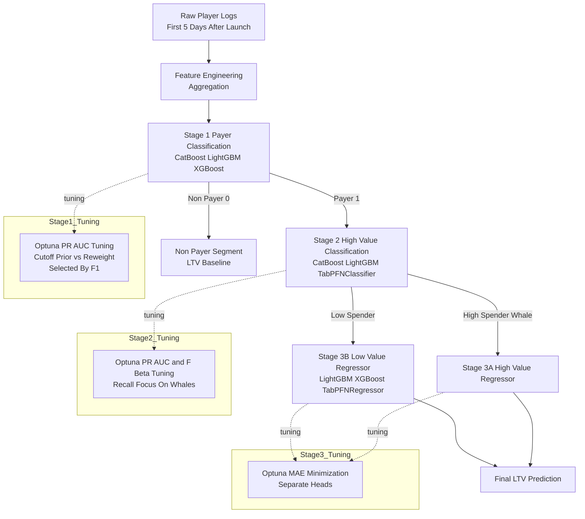

# Kakao Games LTV Prediction Pipeline

Our work targets two core challenges in game monetization modeling:

**1. Predicting long-term LTV using only early logs after launching** (launch-period behavior → lifetime value).

**2. Accurately predicting LTV for extremely high-value payers** whose spending dominates overall revenue distribution.

These goals shape the entire architecture of our 3-stage pipeline, enabling robust prediction in extremely imbalanced, heavy-tailed spending environments. (3-Stage Architecture)

This project implements a **three-stage machine learning pipeline** designed to predict **Lifetime Value (LTV)** of Kakao Games users. The pipeline is optimized for highly imbalanced spending distributions and leverages both classification and regression models in a hierarchical structure.

# Project Overview

Predicting player LTV in mobile games is challenging due to:

* Strong **class imbalance** (many non-spenders vs. few spenders)
* **Long-tailed distribution** among spenders
* The need to model **heterogeneous behavioral patterns**

To address this, we use a **3-stage pipeline**:

1. **Stage 1 – Payer Classification** (Non-payer vs. Payer)
2. **Stage 2 – High-value Payer Classification** (Low spender vs. High spender)
3. **Stage 3 – Two-head Regression** (Separate regressors for each segment)

# Pipeline Architecture

# Stage Descriptions

## **Stage 1 — Payer Classification**

* **Goal:** Predict whether a user will spend *any* amount.
* **Task Type:** Binary classification
* **Model:** Boosting model (LightGBM / XGBoost / CatBoost)
* **Input:** 5 days log data after launching game (including 10 months PAY_AMT_SUM column for training)
* **Output:** `payer_pred ∈ {0,1}`

**Key Notes**

* Handles heavy class imbalance using stratified splits & weighted loss.
* Outputs predictions used to filter data for Stage 2.

## **Stage 2 — High-value Payer Classification**

* **Goal:** Among predicted payers, classify them as **high spender** or **low spender**.
* **Task Type:** Binary classification
* **Model:** TabPFNClassifier and Boosting classifier (TabPFN / LightGBM / XGBoost)
* **Input:** Subset of users predicted as payers in Stage 1
* **Output:** `high_value_pred ∈ {0,1}`

**Key Notes**

* Cutoff for defining high-value payers is based on top-percentile spend (top 5%).
* Important for directing users to the correct regression head.

## **Stage 3 — Two-Head Regression**

* **Goal:** Predict final LTV with separate regressors:

  * **Head A:** High-value regressor
  * **Head B:** Low-value regressor
* **Task Type:** Regression
* **Input:** Segmented output from Stage 2
* **Model:** TabPFNRegressor and Boosting regressors (TabPFN / LightGBM / XGBoost)
* **Output:** `ltv_pred ∈ ℝ₊`

**Why Two Heads?**

* High- and low-value payers follow **fundamentally different** behavior patterns.
* Separate regressors reduce bias and improve fit on the heavy-tailed upper segment.

# Tuning and Optimization Strategy

Below are the detailed strategies applied per stage, reflecting the content from the attached images.

# Stage 1 — Payer Classification (Non‑payer vs Payer)

### **Model Ensemble**

* CatBoost + LightGBM + XGBoost (boosting ensemble)

### **Hyperparameter Tuning**

* **Optuna tuning using PR‑AUC** as the primary optimization metric (due to extreme imbalance)
* Exploration of two cutoff strategies:

  * **prior** cutoff
  * **reweight** cutoff
* Strategy automatically selected based on **F1 maximization**

### **Ensembling**

* **Hard voting** used for select final models at each seed

# Stage 2 — High-value (Whale) Classification

### **Data Filtering**

* Only *payers predicted by Stage 1* are used
* Whale cutoff = **top 5% of spenders** based on training distribution

### **Model Ensemble**

* CatBoost + LightGBM + TabPFNClassifier

### **Hyperparameter Tuning**

* Same two‑strategy tuning as Stage 1 (**prior vs reweight**)
* Optuna tuning based on **PR‑AUC**
* Whale classifier specifically optimized using **F‑BETA** (β > 1) to emphasize recall of high‑value users

### **Ensembling**

* **Hard voting** used for select final models at each seed

# Stage 3 — Regression (High‑value / Low‑value)

### **Model Architecture**

* CatBoost + LightGBM + TabPFNRegressor
* Two completely separate regressors trained:

  * High‑value regressor
  * Low‑value regressor

### **Loss Function & Optimization**

* All regressors trained to directly minimize **MAE (L1 Loss)**
* Optuna tuning using **MAE minimization objective**

### **Ensembling Strategy**

* At each seed, predictions averaged via **mean or weighted mean**

# Summary of Optimization Methods

| Stage       | Objective Metric | Tuning Target                            | Ensemble Method           |
| ----------- | ---------------- | ---------------------------------------- | ------------------------- |
| **Stage 1** | PR‑AUC           | F1‑optimized cutoff (prior vs reweight)  | Hard vote                 |
| **Stage 2** | PR‑AUC / F‑BETA  | Recall‑heavy whale discrimination        | Hard vote                 |
| **Stage 3** | MAE              | Minimize absolute error for two segments | Simple/Weighted mean      |

